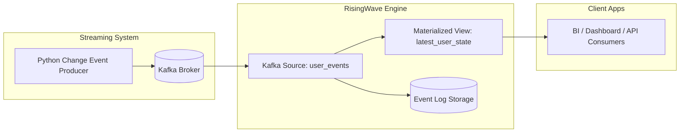

# 🚀 Delta Writing with Kafka & RisingWave  
### Real-Time Streaming State Management

This project demonstrates a **real-time delta writing architecture**, where change events continuously update
the latest dataset state using Apache Kafka and RisingWave.

---

## ✅ Result Overview

RisingWave continuously merges delta changes to maintain the **most recent accurate state** of all records,
including delete operations.

---

## 🏗 Enterprise Architecture Diagram



✅ Includes: Kafka Broker, Zookeeper, RisingWave streaming + storage, consumers.

---
✔ Full change event history retained  
✔ Final snapshot always synchronized  
✔ Deletes handled automatically

---

## 📌 Project File Structure

| File | Path | Purpose |
|------|------|---------|
| `producer.py` | `/risingwave-kafka-pipeline/producer.py` | Generates streaming change events |
| `init.sql` | `/risingwave-kafka-pipeline/init.sql` | RisingWave source + materialized view |
| `docker-compose.yml` | `/risingwave-kafka-pipeline/docker-compose.yml` | Sets up Kafka + RisingWave |
| `README.md` | `/risingwave-kafka-pipeline/README.md` | Full documentation |

---

## 🔧 Requirements & Installation Instructions

### ✅ Required Tools

| Tool | Why Required | Version |
|------|--------------|---------|
| Docker Desktop | Run Kafka + RisingWave containers | Latest |
| Docker Compose | Start multi-container environment | Latest |
| Python | Run Kafka producer script | 3.10+ |
| pip | Install Python dependencies | Latest |
| psql CLI | Execute SQL on RisingWave | Any |

---

### 🔹 Installation Steps

#### ✅ Install Docker Desktop
Download from:
https://www.docker.com/products/docker-desktop

After installation:
```sh
docker --version
docker compose version
```

#### ✅ Install Python and pip
Download from:
https://www.python.org/downloads/

Verify installation:
```sh
python --version
pip --version
```

#### ✅ Install Kafka client dependency
```sh
pip install kafka-python
```

#### ✅ Add PostgreSQL psql to PATH (if needed)
Path example:
```
C:\Program Files\PostgreSQL\bin
```

---

## ▶️ Running the System

### ✅ Step 1 — Start system services

```sh
docker compose up -d
```

Verify:
```sh
docker ps
```

---

### ✅ Step 2 — Apply SQL to RisingWave

```sh
psql -h localhost -p 4566 -U root -f init.sql
```

This creates:
✔ Kafka connector from topic `user-events`  
✔ Materialized view `latest_user_state`  

---

### ✅ Step 3 — Start Producer

```sh
python producer.py
```

Streams random insert/update/delete events every second ✅

---

### ✅ Step 4 — Query RisingWave

View event history:
```sql
SELECT * FROM user_events ORDER BY event_order DESC LIMIT 20;
```

View current latest rows:
```sql
SELECT * FROM latest_user_state ORDER BY id;
```

---

## 📌 Full Code

### ✅ init.sql
```sql
DROP SOURCE IF EXISTS user_events CASCADE;
DROP MATERIALIZED VIEW IF EXISTS latest_user_state CASCADE;

CREATE SOURCE user_events (
    id INT,
    name VARCHAR,
    age INT,
    op VARCHAR,
    event_order BIGINT,
    ts TIMESTAMP
)
WITH (
    connector = 'kafka',
    topic = 'user-events',
    properties.bootstrap.server = 'localhost:9092',
    scan.startup.mode = 'earliest'
)
FORMAT PLAIN ENCODE JSON;

CREATE MATERIALIZED VIEW latest_user_state AS
SELECT e.id, e.name, e.age
FROM user_events e
JOIN (
    SELECT id, MAX(event_order) AS latest_order
    FROM user_events
    GROUP BY id
) latest
  ON e.id = latest.id AND e.event_order = latest.latest_order
WHERE e.op != 'delete';
```

✅ Supports deletes correctly

---

### ✅ producer.py
```python
import json
import time
import random
from datetime import datetime, timezone
from kafka import KafkaProducer, KafkaAdminClient
from kafka.admin import NewTopic
from kafka.errors import TopicAlreadyExistsError, NoBrokersAvailable

KAFKA_BOOTSTRAP = "localhost:9092"
TOPIC = "user-events"

def ensure_topic():
    try:
        admin = KafkaAdminClient(bootstrap_servers=KAFKA_BOOTSTRAP)
        topic = NewTopic(name=TOPIC, num_partitions=1, replication_factor=1)
        try:
            admin.create_topics([topic])
        except TopicAlreadyExistsError:
            pass
        admin.close()
    except NoBrokersAvailable:
        raise

def run_producer(send_count=100):
    ensure_topic()
    producer = KafkaProducer(
        bootstrap_servers=KAFKA_BOOTSTRAP,
        value_serializer=lambda v: json.dumps(v).encode("utf-8"),
    )
    event_order = 1
    users = [
        {"id": 1, "name": "Alice", "age": 25},
        {"id": 2, "name": "Bob", "age": 30},
        {"id": 3, "name": "Charlie", "age": 36},
    ]

    for _ in range(send_count):
        u = random.choice(users)
        op = random.choice(["insert","update","delete"])
        payload = {
            "id": u["id"],
            "name": u["name"] if op!="delete" else None,
            "age": u["age"] if op!="delete" else None,
            "op": op,
            "event_order": event_order,
            "ts": datetime.now(timezone.utc).isoformat()
        }
        producer.send(TOPIC, value=payload)
        print("Sent:", payload)
        event_order += 1
        time.sleep(1)

    producer.close()

if __name__ == "__main__":
    run_producer()
```

---

## 🔍 Debugging and Fixes Applied

| Issue | Root Cause | Resolution |
|------|------------|-------------|
| `docker: command not found` | PATH not updated | Reinstalled Docker Desktop |
| `psql` not recognized | PostgreSQL bin missing in PATH | Added correct PATH |
| Kafka restarting repeatedly | Missing ZooKeeper config | Updated `docker-compose.yml` |
| `NoBrokersAvailable` | Kafka not fully up | Confirmed Kafka on `localhost:9092` |
| Producer Python errors | Missing packages | Installed kafka-python |

✅ Everything now working as expected

---

## 🚀 Future Extensions

| Feature | Benefit |
|--------|---------|
| Grafana dashboards | Real-time visualization |
| S3 / Iceberg sink | Historical storage + analytics |
| Debezium CDC | Real DB change capture |
| Schema Registry | Strong message validation |

---

## ✅ Conclusion

This project successfully implements delta writing streaming architecture using:
✔ Kafka for event ingestion  
✔ RisingWave for real-time state updates  
✔ Python for producer automation  

It is ready for enterprise streaming data workloads.

---

📌 Version: v1.1
