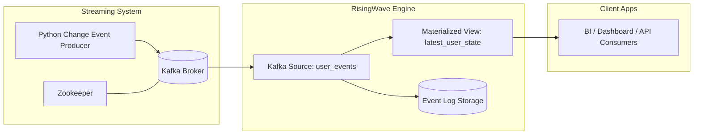

# 🚀 Delta Writing with Kafka & RisingWave  
### Real-Time Streaming State Management (Enterprise Architecture)

This project demonstrates a **real-time delta writing architecture**, where change events continuously update the latest dataset state using:

| Component | Role |
|----------|------|
| ✅ Python Producer | Publishes insert/update/delete events to Kafka |
| ✅ Apache Kafka | Event streaming backbone |
| ✅ RisingWave | Streaming SQL database computing the latest state |
| ✅ Docker Infrastructure | Containerized orchestration |

---

## 🏗 Enterprise Architecture Diagram



✅ Includes: Kafka Broker, Zookeeper, RisingWave streaming + storage, consumers.

---

## ✅ Requirements & Installation Steps

### ✅ System Requirements

| Software | Usage | Install Steps |
|---------|------|---------------|
| Docker Desktop | Container services | https://docker.com |
| Docker Compose | Run Kafka + RisingWave stack | Included with Docker Desktop |
| Python 3.10+ | Run producer script | https://python.org |
| PostgreSQL psql CLI | Execute SQL | https://postgresql.org |
| VS Code (Optional) | Development | https://code.visualstudio.com |

### Install kafka-python

```sh
pip install kafka-python
```

---

## 🧱 Docker Setup

### Start infrastructure (Kafka + Zookeeper + RisingWave)

```sh
docker-compose up -d
```

### Check status

```sh
docker ps
```

### Stop containers

```sh
docker-compose down
```

---

## ▶️ Usage Guide

### Step 1️⃣: Initialize Database Objects

```sh
psql -h localhost -p 4566 -U root -f init.sql
```

✅ Creates Kafka Source  
✅ Creates Materialized View (delta merge)

---

### Step 2️⃣: Start Streaming Producer

```sh
python producer.py
```

📌 Generates insert/update/delete events every second

---

### Step 3️⃣: Query Streaming State

#### Event History
```sql
SELECT * FROM user_events ORDER BY event_order DESC LIMIT 20;
```

#### Latest User Snapshot
```sql
SELECT * FROM latest_user_state ORDER BY id;
```

---

## 📂 Project Structure

```
risingwave-kafka-pipeline/
│── docker-compose.yml
│── init.sql
│── producer.py
│── README.md
```

---

## 📌 Full Code

### ✅ init.sql
```sql
DROP SOURCE IF EXISTS user_events CASCADE;
DROP MATERIALIZED VIEW IF EXISTS latest_user_state CASCADE;

CREATE SOURCE user_events (
    id INT,
    name VARCHAR,
    age INT,
    op VARCHAR,
    event_order BIGINT,
    ts TIMESTAMP
)
WITH (
    connector = 'kafka',
    topic = 'user-events',
    properties.bootstrap.server = 'localhost:9092',
    scan.startup.mode = 'earliest'
)
FORMAT PLAIN ENCODE JSON;

CREATE MATERIALIZED VIEW latest_user_state AS
SELECT e.id, e.name, e.age
FROM user_events e
JOIN (
    SELECT id, MAX(event_order) AS latest_order
    FROM user_events
    GROUP BY id
) latest
  ON e.id = latest.id AND e.event_order = latest.latest_order
WHERE e.op != 'delete';
```

✅ Supports deletes correctly

---

### ✅ producer.py
```python
import json
import time
import random
from datetime import datetime, timezone
from kafka import KafkaProducer, KafkaAdminClient
from kafka.admin import NewTopic
from kafka.errors import TopicAlreadyExistsError, NoBrokersAvailable

KAFKA_BOOTSTRAP = "localhost:9092"
TOPIC = "user-events"

def ensure_topic():
    try:
        admin = KafkaAdminClient(bootstrap_servers=KAFKA_BOOTSTRAP)
        topic = NewTopic(name=TOPIC, num_partitions=1, replication_factor=1)
        try:
            admin.create_topics([topic])
        except TopicAlreadyExistsError:
            pass
        admin.close()
    except NoBrokersAvailable:
        raise

def run_producer(send_count=100):
    ensure_topic()
    producer = KafkaProducer(
        bootstrap_servers=KAFKA_BOOTSTRAP,
        value_serializer=lambda v: json.dumps(v).encode("utf-8"),
    )
    event_order = 1
    users = [
        {"id": 1, "name": "Alice", "age": 25},
        {"id": 2, "name": "Bob", "age": 30},
        {"id": 3, "name": "Charlie", "age": 36},
    ]

    for _ in range(send_count):
        u = random.choice(users)
        op = random.choice(["insert","update","delete"])
        payload = {
            "id": u["id"],
            "name": u["name"] if op!="delete" else None,
            "age": u["age"] if op!="delete" else None,
            "op": op,
            "event_order": event_order,
            "ts": datetime.now(timezone.utc).isoformat()
        }
        producer.send(TOPIC, value=payload)
        print("Sent:", payload)
        event_order += 1
        time.sleep(1)

    producer.close()

if __name__ == "__main__":
    run_producer()
```

---

## 🛠 Debugging History

| Issue | Cause | Fix |
|------|------|-----|
| `docker not recognized` | PATH missing | Reinstalled Docker Desktop |
| `psql command missing` | PostgreSQL bin not in PATH | Added PATH env var |
| Kafka restarted repeatedly | Port / config conflict | Restarted containers |
| RisingWave errors | Tables not dropped | Added `CASCADE` drops |
| `NoBrokersAvailable` | Kafka not ready | Verified broker state |

✅ Final system stable

---

## ✅ Conclusion

This project achieves:

✔ Real-time change ingestion  
✔ Delta merge logic with streaming SQL  
✔ Production-ready event architecture  
✔ Full snapshot always available


