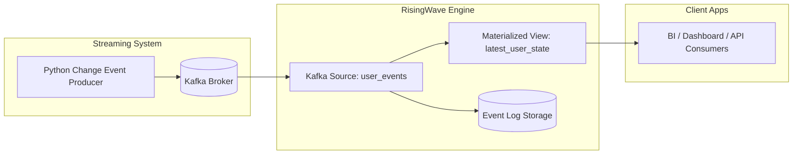

#  Delta Writing with Kafka & RisingWave  (Locally)
### Real-Time Streaming State Management

## What is RisingWave?

RisingWave is a streaming database — a real-time SQL engine built for continuously processing and updating data as new events arrive.
Think of it as a PostgreSQL for real-time streams.You send data (events, logs, change streams) from sources like Kafka, Azure Event Hub, or Kinesis.RisingWave continuously updates your query results — like materialized views — as new events come in.It’s PostgreSQL-compatible, meaning you can query it using normal SQL.

##  What is Delta Writing?

**Delta Writing** means updating the *latest state of data* using **streaming changes** — instead of overwriting entire tables (as in batch jobs).

You **merge incremental updates (deltas)** in real time:

| Operation | Description |
|------------|--------------|
| `INSERT` | Add new records |
| `UPDATE` | Modify existing records |
| `DELETE` | Remove records |

RisingWave can automatically handle these **delta operations** in real time.

---

##  How It Works

RisingWave continuously ingests streams of events (e.g., from **Kafka**, **Azure Event Hub**, or **Blob Storage**), applies SQL-based transformation logic, and maintains **materialized views** that always reflect the **latest data state**.

Unlike batch ETL or nightly merges, RisingWave keeps your tables fresh **continuously**.

---


This project demonstrates a **real-time delta writing architecture**, where change events continuously update
the latest dataset state using Apache Kafka and RisingWave.

---

#  Materialized Views in RisingWave

##  What is a Materialized View?

A **Materialized View (MV)** is a **precomputed table** that **stores the results of a query physically** —  
unlike a normal SQL `VIEW`, which recalculates every time you query it.

In **RisingWave**, a materialized view:

-  Continuously processes **incoming streaming data**
-  Keeps the **result set always up-to-date**
-  Can be queried like a **regular SQL table**

---

#  Advantages of Materialized Views in RisingWave

| **Advantage** | **Explanation** |
|----------------|-----------------|
|  **Real-Time Refresh** | RisingWave automatically updates Materialized Views (MVs) as new data arrives — no manual triggers required. |
|  **Precomputed State** | Query results are stored physically, allowing **instant responses** without recalculating each time. |
|  **Stream + State Integration** | MVs seamlessly merge both **streaming data** and **historical state**, ensuring full context. |
|  **SQL Simplicity** | Define complex logic easily using **standard SQL** (aggregations, joins, filters). |
|  **Persistent Storage** | MVs are stored on disk, so their state is **recoverable** even after restarts or failures. |
|  **Continuous Querying** | Query results remain **live and consistent** without any batch recomputation. |
|  **Low Maintenance** | No need for cron jobs or refresh scripts — RisingWave handles updates **automatically**. |
|  **Scalable Architecture** | Perfect for **Azure ACI** or **AKS** deployments, supporting **large-scale streaming analytics**. |


##  Result Overview

RisingWave continuously merges delta changes to maintain the **most recent accurate state** of all records,
including delete operations.

---

##  Enterprise Architecture Diagram



✅ Includes: Kafka Broker, Zookeeper, RisingWave streaming + storage, consumers.

---
✔ Full change event history retained  
✔ Final snapshot always synchronized  
✔ Deletes handled automatically

---

## 📌 Project File Structure

| File | Path | Purpose |
|------|------|---------|
| `producer.py` | `/risingwave-kafka-pipeline/producer.py` | Generates streaming change events |
| `init.sql` | `/risingwave-kafka-pipeline/init.sql` | RisingWave source + materialized view |
| `docker-compose.yml` | `/risingwave-kafka-pipeline/docker-compose.yml` | Sets up Kafka + RisingWave |
| `README.md` | `/risingwave-kafka-pipeline/README.md` | Full documentation |

---

##  Requirements & Installation Instructions

###  Required Tools

| Tool | Why Required | Version |
|------|--------------|---------|
| Docker Desktop | Run Kafka + RisingWave containers | Latest |
| Docker Compose | Start multi-container environment | Latest |
| Python | Run Kafka producer script | 3.10+ |
| pip | Install Python dependencies | Latest |
| psql CLI | Execute SQL on RisingWave | Any |
| Cntlm | Proxy | 0.92.3 |

---

### 🔹 Installation Steps

#### ✅ Install Docker Desktop
Download from:
https://www.docker.com/products/docker-desktop

After installation:
```sh
docker --version
docker compose version
```

#### ✅ Install Python and pip
Download from:
https://www.python.org/downloads/

Verify installation:
```sh
python --version
pip --version
```

#### ✅ Install Kafka client dependency
```sh
pip install kafka-python
```

#### ✅ Add PostgreSQL psql to PATH (if needed)
Path example:
```
C:\Program Files\PostgreSQL\bin
```

---

## ▶️ Running the System

### ✅ Step 1 — Start system services

```sh
docker compose up -d
```

Verify:
```sh
docker ps
```
Output:
```sh
PS C:\Users\lhl3kor\risingwave-kafka-pipeline> docker compose up -d
time="2025-11-03T10:32:47+05:30" level=warning msg="C:\\Users\\lhl3kor\\risingwave-kafka-pipeline\\docker-compose.yml: the attribute `version` is obsolete, it will be ignored, please remove it to avoid potential confusion"
[+] Running 3/3
 ✔ Container zookeeper   Running                                                                                   0.0s
 ✔ Container kafka       Running                                                                                   0.0s
 ✔ Container risingwave  Running                                                                                   0.0s
PS C:\Users\lhl3kor\risingwave-kafka-pipeline> docker ps
>>
CONTAINER ID   IMAGE                              COMMAND                  CREATED      STATUS          PORTS                                                                                      NAMES
5f062d1781b9   risingwavelabs/risingwave:v2.6.1   "/risingwave/bin/ris…"   3 days ago   Up 15 seconds   0.0.0.0:4566->4566/tcp, [::]:4566->4566/tcp, 0.0.0.0:5691->5691/tcp, [::]:5691->5691/tcp   risingwave
6198b6709031   confluentinc/cp-kafka:7.4.0        "/etc/confluent/dock…"   3 days ago   Up 15 seconds   0.0.0.0:29092->29092/tcp, [::]:29092->29092/tcp                                            kafka
39a4da54b44c   confluentinc/cp-zookeeper:7.4.0    "/etc/confluent/dock…"   3 days ago   Up 15 seconds   0.0.0.0:2181->2181/tcp, [::]:2181->2181/tcp                                                zookeeper
```
---

### ✅ Step 2 — Apply SQL to RisingWave

```sh
psql -h localhost -p 4566 -U root -d dev -f init.sql

```

This creates:
✔ Kafka connector from topic `user-events`  
✔ Materialized view `latest_user_state`  

Output:
```sh
PS C:\Users\lhl3kor\risingwave-kafka-pipeline\sql> psql -h localhost -p 4566 -U root -d dev -f init.sql
DROP_SOURCE
psql:init.sql:2: NOTICE:  materialized view "latest_user_state" does not exist, skipping
DROP_MATERIALIZED_VIEW
CREATE_SOURCE
CREATE_MATERIALIZED_VIEW
```
---

### ✅ Step 3 — Start Producer

```sh
python producer.py
```

Streams random insert/update/delete events every second ✅

Output:
```sh
PS C:\Users\lhl3kor\risingwave-kafka-pipeline> python producer.py
📡 Sending events to Kafka topic 'user-events' via localhost:29092...

✅ Sent: {'id': 3, 'name': 'Charlie', 'age': 35, 'op': 'update', 'event_order': 1, 'ts': '2025-11-03 05:42:25'}
✅ Sent: {'id': 1, 'name': 'Alice', 'age': 24, 'op': 'update', 'event_order': 2, 'ts': '2025-11-03 05:42:26'}
✅ Sent: {'id': 1, 'name': None, 'age': 25, 'op': 'delete', 'event_order': 3, 'ts': '2025-11-03 05:42:27'}
✅ Sent: {'id': 1, 'name': 'Alice', 'age': 25, 'op': 'insert', 'event_order': 4, 'ts': '2025-11-03 05:42:28'}
✅ Sent: {'id': 1, 'name': 'Alice', 'age': 27, 'op': 'update', 'event_order': 5, 'ts': '2025-11-03 05:42:29'}
✅ Sent: {'id': 3, 'name': 'Charlie', 'age': 36, 'op': 'insert', 'event_order': 6, 'ts': '2025-11-03 05:42:30'}
✅ Sent: {'id': 3, 'name': 'Charlie', 'age': 36, 'op': 'insert', 'event_order': 7, 'ts': '2025-11-03 05:42:31'}
✅ Sent: {'id': 2, 'name': 'Bob', 'age': 32, 'op': 'update', 'event_order': 8, 'ts': '2025-11-03 05:42:32'}
✅ Sent: {'id': 2, 'name': None, 'age': 30, 'op': 'delete', 'event_order': 9, 'ts': '2025-11-03 05:42:33'}
✅ Sent: {'id': 2, 'name': 'Bob', 'age': 30, 'op': 'insert', 'event_order': 10, 'ts': '2025-11-03 05:42:38'}
✅ Sent: {'id': 2, 'name': 'Bob', 'age': 32, 'op': 'update', 'event_order': 11, 'ts': '2025-11-03 05:42:39'}
✅ Sent: {'id': 2, 'name': None, 'age': 30, 'op': 'delete', 'event_order': 12, 'ts': '2025-11-03 05:42:40'}
✅ Sent: {'id': 2, 'name': None, 'age': 30, 'op': 'delete', 'event_order': 13, 'ts': '2025-11-03 05:42:41'}

🛑 Stopped by user.
🚀 All messages sent and producer closed.
```
---

### ✅ Step 4 — Query RisingWave

Run: 
```sql
psql -h localhost -p 4566 -U root -d dev
```
View event history:
```sql
SELECT * FROM user_events ORDER BY event_order DESC LIMIT 20;
```
Output:
```sql
dev=> SELECT * FROM user_events ORDER BY event_order DESC LIMIT 10;
 id |  name   | age |   op   | event_order |         ts
----+---------+-----+--------+-------------+---------------------
  2 |         |  30 | delete |         506 | 2025-10-30 07:00:01
  3 | Charlie |  38 | update |         505 | 2025-10-30 07:00:00
  1 |         |  25 | delete |         504 | 2025-10-30 06:59:59
  3 | Charlie |  38 | update |         503 | 2025-10-30 06:59:58
  3 | Charlie |  36 | insert |         502 | 2025-10-30 06:59:57
  1 | Alice   |  24 | update |         501 | 2025-10-30 06:59:56
  3 | Charlie |  36 | insert |         500 | 2025-10-30 06:59:55
  3 |         |  36 | delete |         499 | 2025-10-30 06:59:54
  3 | Charlie |  36 | insert |         498 | 2025-10-30 06:59:53
  3 |         |  36 | delete |         497 | 2025-10-30 06:59:50
(10 rows)
```
View current latest rows:
```sql
SELECT * FROM latest_user_state ORDER BY id;
```
Output:
```sql
dev=> SELECT * FROM latest_user_state ORDER BY id;
 id |  name   | age |   op   |         ts
----+---------+-----+--------+---------------------
  3 | Charlie |  38 | update | 2025-10-30 07:00:00
(1 row)
```
---

## 📌 Full Code
### ✅ docker-compose.yml
```yaml
version: "3.9"

services:
  zookeeper:
    image: confluentinc/cp-zookeeper:7.4.0
    container_name: zookeeper
    environment:
      ZOOKEEPER_CLIENT_PORT: 2181
    ports:
      - "2181:2181"
    restart: always

  kafka:
    image: confluentinc/cp-kafka:7.4.0
    container_name: kafka
    depends_on:
      - zookeeper
    environment:
      KAFKA_BROKER_ID: 1
      KAFKA_ZOOKEEPER_CONNECT: zookeeper:2181
      KAFKA_LISTENERS: PLAINTEXT://0.0.0.0:9092,PLAINTEXT_HOST://0.0.0.0:29092
      KAFKA_ADVERTISED_LISTENERS: PLAINTEXT://kafka:9092,PLAINTEXT_HOST://localhost:29092
      KAFKA_LISTENER_SECURITY_PROTOCOL_MAP: PLAINTEXT:PLAINTEXT,PLAINTEXT_HOST:PLAINTEXT
      KAFKA_INTER_BROKER_LISTENER_NAME: PLAINTEXT
      KAFKA_OFFSETS_TOPIC_REPLICATION_FACTOR: 1
      ALLOW_PLAINTEXT_LISTENER: "yes"
    ports:
      - "29092:29092"
    restart: always

  risingwave:
    image: risingwavelabs/risingwave:v2.6.1
    container_name: risingwave
    # use the single_node entrypoint (works across versions 2.6.x)
    command: ["single_node"]
    depends_on:
      - kafka
    ports:
      - "4566:4566"   # pgwire for psql
      - "5691:5691"   # dashboard API (optional)
    environment:
      # adjust memory settings if you have many resources; keep modest defaults
      RW_COMPACTOR_TOTAL_MEMORY_BYTES: 4294967296   # 4GB compactor memory
      RW_RESERVED_MEMORY_BYTES: 1610612736          # 1.5GB reserved
    restart: always
```

### ✅ init.sql
```sql
DROP SOURCE IF EXISTS user_events CASCADE;
DROP MATERIALIZED VIEW IF EXISTS latest_user_state CASCADE;

CREATE SOURCE user_events (
    id INT,
    name VARCHAR,
    age INT,
    op VARCHAR,
    event_order BIGINT,
    ts TIMESTAMP
)
WITH (
    connector = 'kafka',
    topic = 'user-events',
    properties.bootstrap.server = 'kafka:9092',
    scan.startup.mode = 'earliest'
)
FORMAT PLAIN ENCODE JSON;

-- Materialized view to maintain only the latest active record
CREATE MATERIALIZED VIEW latest_user_state AS
SELECT e.id, e.name, e.age, e.op, e.ts
FROM user_events e
JOIN (
    SELECT id, MAX(event_order) AS latest_order
    FROM user_events
    GROUP BY id
) latest
ON e.id = latest.id AND e.event_order = latest.latest_order
WHERE e.op != 'delete';

```

✅ Supports deletes correctly

---

### ✅ producer.py
```python
# producer.py
import json
import time
import random
from datetime import datetime, timezone
from kafka import KafkaProducer

MODE = "host"  
BOOTSTRAP = "localhost:29092" if MODE == "host" else "kafka:9092"
TOPIC = "user-events"


producer = KafkaProducer(
    bootstrap_servers=BOOTSTRAP,
    value_serializer=lambda v: json.dumps(v).encode("utf-8"),
    retries=5,
    linger_ms=5
)

users = [
    {"id": 1, "name": "Alice", "age": 25},
    {"id": 2, "name": "Bob", "age": 30},
    {"id": 3, "name": "Charlie", "age": 36},
]


event_order = 1
print(f"📡 Sending events to Kafka topic '{TOPIC}' via {BOOTSTRAP}...\n")

try:
    while True:
        user = random.choice(users)
        op = random.choice(["insert", "update", "delete"])

        event = {
            "id": user["id"],
            "name": user["name"] if op != "delete" else None,
            "age": user["age"] + random.randint(-2, 2) if op == "update" else user["age"],
            "op": op,
            "event_order": event_order,
            "ts": datetime.now(timezone.utc).strftime("%Y-%m-%d %H:%M:%S")
        }

        producer.send(TOPIC, value=event)
        print(f"✅ Sent: {event}")

        event_order += 1
        time.sleep(1)

except KeyboardInterrupt:
    print("\n🛑 Stopped by user.")

except Exception as e:
    print(f"❌ Send error: {e}")

finally:
    producer.flush()
    producer.close()
    print("🚀 All messages sent and producer closed.")

```

---

## 🔍 Debugging and Fixes Applied

| Issue | Root Cause | Resolution |
|------|------------|-------------|
| `docker: command not found` | PATH not updated | Reinstalled Docker Desktop |
| `psql` not recognized | PostgreSQL bin missing in PATH | Added correct PATH |
| Kafka restarting repeatedly | Missing ZooKeeper config | Updated `docker-compose.yml` |
| `NoBrokersAvailable` | Kafka not fully up | Confirmed Kafka on `localhost:9092` |
| Producer Python errors | Missing packages | Installed kafka-python |
|Any proxy issue | Bosch proxy | Replace your Cntlm.ini file with the file in the repo | 

Refer [Debug_History_Risingwave.md](https://github.com/Nishaanth419/Delta_Writing_Risingwave/blob/main/Debug_History_Risingwave.md) for full Debugging and Fixes Applied
✅ Everything now working as expected

---

## 🚀 Future Extensions

| Feature | Benefit |
|--------|---------|
| Grafana dashboards | Real-time visualization |
| S3 / Iceberg sink | Historical storage + analytics |
| Debezium CDC | Real DB change capture |
| Schema Registry | Strong message validation |

---

## ✅ Conclusion

This project successfully implements delta writing streaming architecture using:
✔ Kafka for event ingestion  
✔ RisingWave for real-time state updates  
✔ Python for producer automation  
--------------------------------------------------------------------------------------------------------------------------------------------------------------------------------------------------------------------------------------------------------------------------------------------------------------------------------------------------------------------------------------------------------------------------------------

# 💠 Delta Writing with RisingWave  (Azure)

This table lists all **Azure services** required or recommended for implementing a **RisingWave Delta Writing Pipeline** — including event ingestion, storage, compute, and monitoring.

---

| **Category** | **Azure Service** | **Purpose / Role in Pipeline** | 
|---------------|------------------|--------------------------------|----------------|
| ☁️ **Compute / Database** | **Azure Container Instance (ACI)** or **Azure Kubernetes Service (AKS)** | Hosts **RisingWave** (streaming SQL engine). RisingWave reads, processes, and merges data from streams. |
| 🧩 **Streaming** | **Azure Event Hub** | Acts as the **message broker / ingestion pipeline** where your app sends insert, update, and delete events. | 
| 📦 **Storage** | **Azure Blob Storage** | Stores **JSON event data** from Event Hub Capture. RisingWave reads these files for delta merging. | ✅ Yes |
| 🔄 **Event Hub Capture (built-in feature)** | *Built-in, no extra service* | Automatically exports data from Event Hub to Blob Storage every N seconds/minutes. | 
| 🔐 **Azure Key Vault** | Stores **sensitive secrets** (Event Hub connection strings, Storage account keys, RisingWave credentials). | 
| ⚙️ **Azure Functions (optional)** | Provides **serverless automation** for data refresh or post-processing (e.g., notifying RisingWave or moving files). | 
| 🗂️ **Azure Resource Group** | Logical **container for all Azure resources**, simplifying management and cost tracking. |
| 🕵️ **Azure Monitor** | Provides **logging and metrics** for Event Hub throughput, Blob writes, and RisingWave container health. | Recommended |
| 🧰 **Azure Virtual Network (VNet)** | Enables **private networking** between Event Hub, Blob, and RisingWave for secure internal communication. | 
| 🚀 **Azure Container Registry (ACR)** | Stores **custom RisingWave Docker images** for CI/CD or enterprise deployment. | 
| 📊 **Azure Log Analytics / Application Insights** | Offers **deep monitoring** and query insights for Event Hub ingestion, Blob activity, and RisingWave performance. |

---

## ✅ Summary

- **Minimum Required Services:**  
  - Azure Event Hub  
  - Azure Blob Storage  
  - Azure Container Instance (or AKS)  
  - Azure Resource Group  

- **Recommended:**  
  - Azure Key Vault  
  - Azure Monitor  

- **Optional (for Future production ):**  
  - Azure Functions  
  - Azure Virtual Network  
  - Azure Container Registry  
  - Azure Log Analytics  

---

> 🧠 **Tip:**  
> For small-scale testing, you can deploy RisingWave via **Azure Container Instance (ACI)** with Event Hub Capture → Blob → RisingWave flow.  
> For production workloads,  **AKS + VNet + ACR + Monitor** for better scalability, observability, and security.


---

